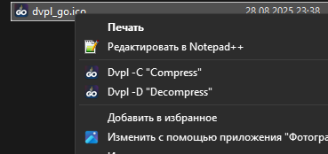
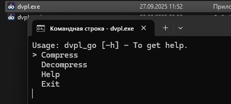

# dvpl_go [НАЗАД](./../README.md)

> [!NOTE]
> Инструкция по использованию и установке утилиты **dvpl**.

---

## Описание

Утилита **dvpl_go** позволяет работать с файлами в формате DVPL. Она может быть использована в двух режимах:

1. **Полная установка**: После установки утилита интегрируется в контекстное меню операционной системы, что позволяет быстро запускать её для выбранных файлов или папок (см. скриншот ниже).
2. **Ручной запуск**: Конвертер можно поместить в любую папку и запускать его непосредственно оттуда. В этом случае доступны два режима работы:
   - Сжатие файлов в формат DVPL.
   - Распаковка файлов из формата DVPL.

---

## Установка

### Полная установка
1. Запустите установщик из `Releases`.
2. Следуйте инструкциям в установщике.
3. Выберите вариант интеграции утилиты в контекстное меню (рекомендуется для удобства использования).

После завершения установки вы сможете использовать утилиту через контекстное меню, как показано на скриншоте.

### Ручная установка
1. Скачайте архив под свою архитектуру из раздела **Releases**.
2. Распакуйте содержимое архива в любую удобную для вас папку (например, на рабочий стол).
3. Используйте утилиту напрямую из этой папки.

---

## Использование

### Через контекстное меню
1. Выделите файл или папку, которую хотите обработать.
2. Щелкните правой кнопкой мыши и выберите соответствующий пункт меню (сжатие или распаковка).
3. Утилита автоматически выполнит необходимые действия.

  
_Пример интеграции утилиты в контекстное меню_

### Через ручной запуск
1. Поместите файл `dvpl.exe` в папку с целевыми файлами.
2. Запустите утилиту одним из следующих способов:
   - Для **сжатия**: Перетащите файл или папку на исполняемый файл `dvpl.exe`.
   - Для **распаковки**: Запустите утилиту из командной строки с соответствующими параметрами (подробнее см. в документации внутри архива).

  
_Пример интеграции утилиты в контекстное меню_

---

## Примечания
- Если вы используете утилиту без установки, убедитесь, что она находится в той же папке, где находятся целевые файлы, или укажите правильный путь к ним.
- Для получения дополнительной информации о параметрах командной строки обратитесь к документации внутри архива `dvpl_go.zip`.
