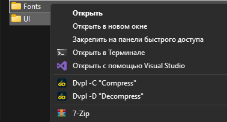
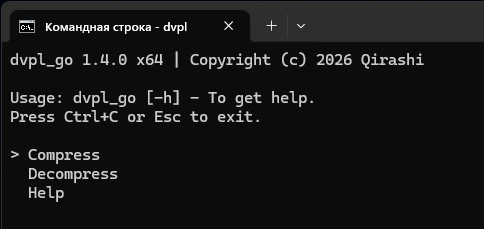

# dvpl_go [BACK](./../README.md)

## Description

**dvpl_go** is a utility for working with DVPL format files. It can be used in three modes:

1. **Full installation**: After installation, the utility integrates into the operating system's context menu, allowing quick access for selected files or folders (see screenshot below).

2. **Manual launch**: You can place the converter in any folder and run it directly from there. Two operation modes are available:
   - Compress files to DVPL format
   - Decompress files from DVPL format

3. **Drag & Drop**: Drag and drop files onto the `dvpl.exe` executable for quick compression or decompression.

## Installation

### Full installation
1. Run the installer from the **Releases** section
2. Follow the installer instructions
3. Choose the context menu integration option (recommended for ease of use)

After installation, you can use the utility via the context menu as shown in the screenshot.

### Manual installation
1. Download the archive for your architecture from the **Releases** section
2. Extract the contents to any convenient folder (e.g., desktop)
3. Use the utility directly from that folder

## Usage

### Via context menu
1. Select a file or folder to process
2. Right-click and choose the appropriate menu item (compress or decompress)
3. The utility will automatically perform the required actions

  
_Context menu integration_

### Via manual launch
1. Place `dvpl.exe` in the folder with your target files
2. Launch the utility using one of these methods:
   - For compression: drag and drop files onto `dvpl.exe`
   - For decompression: use the command line (see `dvpl.exe -h` for details)

  
_Regular program launch_